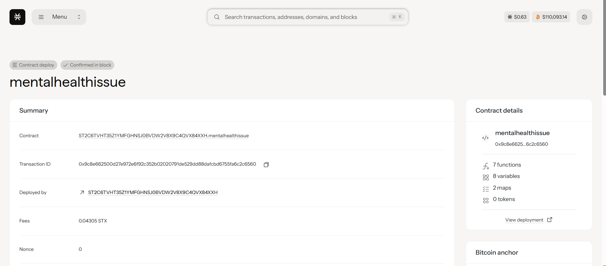

# Mental Health Community Support Platform

## Project Description

The Mental Health Community Support Platform is a blockchain-based solution that enables communities to collectively fund mental health services while maintaining user privacy and fostering peer support networks. Built on the Stacks blockchain using Clarity smart contracts, this platform creates a transparent, decentralized system where community members can contribute funds and mental health professionals can register their services.

The platform addresses the critical gap in mental health service accessibility by creating a community-driven funding mechanism that removes financial barriers while protecting user anonymity. Contributors can donate STX tokens to a shared fund, and qualified mental health service providers can register their services to be funded by this community pool.

## Project Vision

Our vision is to revolutionize mental health care accessibility by creating a decentralized, community-driven ecosystem that:

- **Democratizes Mental Health Funding**: Enables communities to collectively support mental health services, making them accessible to those who need them most, regardless of their financial situation
- **Preserves Privacy and Dignity**: Protects user anonymity while providing transparency in fund allocation and service provision
- **Builds Sustainable Support Networks**: Creates lasting peer-to-peer support systems that extend beyond individual therapy sessions
- **Empowers Local Communities**: Gives communities direct control over their mental health resources and service providers
- **Reduces Stigma**: Normalizes mental health support by making it a community-wide initiative rather than an individual struggle

We envision a world where mental health support is universally accessible, community-supported, and free from financial constraints or privacy concerns.

## Future Scope

The Mental Health Community Support Platform has extensive potential for growth and enhancement:

### Phase 2 - Enhanced Features
- **Peer Support Matching**: Algorithm-based matching system for peer support groups based on shared experiences and preferences
- **Session Booking System**: Integrated calendar and booking functionality for scheduling mental health services
- **Anonymous Feedback System**: Allow service users to provide feedback on providers while maintaining complete anonymity
- **Multi-token Support**: Accept various cryptocurrency donations beyond STX

### Phase 3 - Advanced Functionality  
- **AI-Powered Triage**: Implement AI-assisted initial screening to match users with appropriate service types
- **Crisis Intervention Protocol**: 24/7 crisis support network with immediate response capabilities
- **Therapeutic Resource Library**: Decentralized library of mental health resources, guided meditations, and self-help materials
- **Provider Verification System**: Enhanced credentialing and verification system for mental health professionals

### Phase 4 - Ecosystem Expansion
- **Cross-Platform Integration**: Integration with existing telehealth platforms and mental health apps
- **Insurance Integration**: Work with insurance providers to supplement community funding
- **Global Network**: Expand to create interconnected mental health support networks across different regions
- **Research Partnership**: Collaborate with mental health research institutions to improve service effectiveness

### Long-term Goals
- **Policy Advocacy**: Use platform data (anonymized) to advocate for better mental health policies
- **Corporate Partnerships**: Partner with companies to provide employee mental health benefits through the platform
- **Educational Integration**: Expand into schools and universities to provide student mental health support
- **Mobile App Development**: Create user-friendly mobile applications for easier access to services

## Contract Address Details
Contract ID:-
ST2C6TVHT35Z1YMFGHNSJ0BVDW2V8X9C4QVX84XXH.mentalhealthissue

### Prerequisites
- Stacks wallet (Hiro Wallet, Xverse, etc.)
- STX tokens for contributions
- Basic understanding of blockchain transactions

### For Community Contributors
1. Connect your Stacks wallet to the platform
2. Use the `contribute-to-fund` function to donate STX tokens
3. Track your contributions and the total community fund
4. Support grows the collective resource pool for mental health services

### For Mental Health Service Providers
1. Verify your professional credentials (off-chain process)
2. Use the `register-service` function to list your services
3. Specify your service type and session cost
4. Begin providing services funded by the community pool

### Key Functions

**contribute-to-fund(amount)**
- Allows community members to contribute STX to the mental health fund
- Parameters: `amount` (uint) - Amount of STX to contribute
- Maintains contributor privacy while ensuring transparency

**register-service(service-type, cost-per-session)**  
- Enables mental health professionals to register their services
- Parameters: 
  - `service-type` (string) - Type of mental health service offered
  - `cost-per-session` (uint) - Cost per session in STX
- Returns a unique service ID for the registered service

### Privacy Protection
This platform prioritizes user privacy by:
- Not storing personal health information on-chain
- Using anonymous contribution tracking
- Implementing secure, private communication channels for service delivery
- Ensuring all transactions maintain user anonymity while providing necessary transparency for fund management

---
